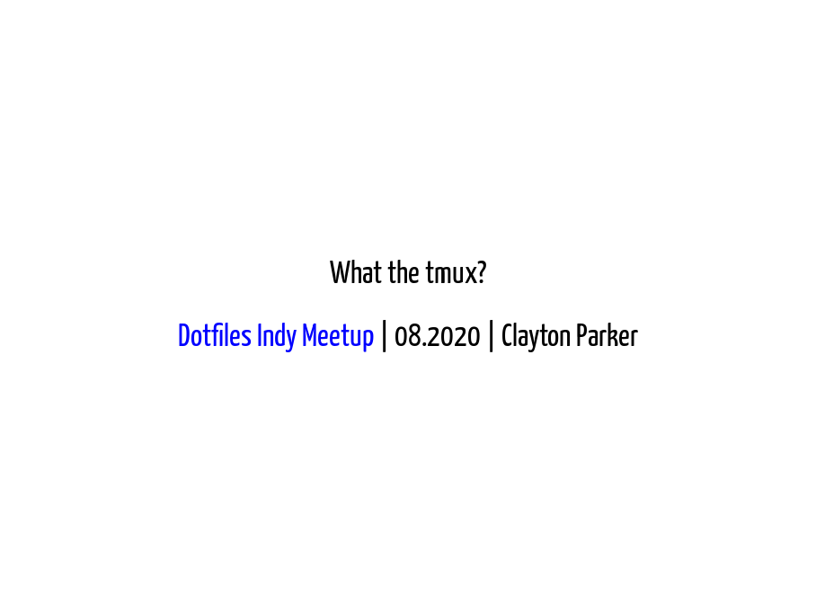

## Description

An introduction to tmux, a terminal multiplexer, which is an alternative to the venerable screen.
Join us to learn why you need this magical program in your toolbox.
We'll cover the usage basics and some slightly more advanced features that make tmux worth picking up.

## More Info

Slides are available via [GitHub Pages in this repo][gh-pages]

PDF available [in this repo][slides-pdf]

Presentation made with [remark][remark].
PDF and slide image generated with [DeckTape][decktape].

[gh-pages]: https://claytron.github.io/what-the-tmux/remark.html
[slides-pdf]: slides.pdf
[remark]: https://github.com/gnab/remark
[decktape]: https://github.com/astefanutti/decktape
