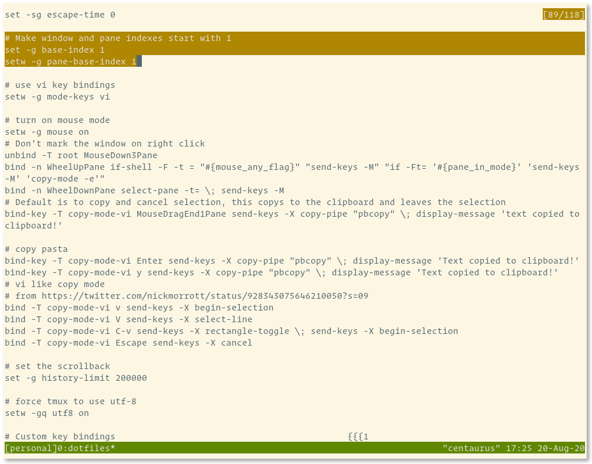

layout: true

---
class: middle, center

### What the tmux?
### [Dotfiles Indy Meetup][dotfiles-indy] | 08.2020 | Clayton Parker

---
class: middle, center

# Who Am I?


[@claytron][twitter-claytron] on the internets and IRL

My [dotfiles][dotfiles-claytron]

???
- known as claytron on the internet and in real life
- Links to my dotfiles and more. I'll share the slides after.

---
class: middle, center

# What is it?

tmux == Terminal MUltipleXer

A better `screen`

???
- Many terminals within a terminal
- A way to save your work for later or organize things locally
- A new take on the idea
- You NEED this in your life for sure

---
class: middle, left

# `tmux` vs `screen`

<table>
<tr valign="top">
<td width="50%">

<h2>Pros</h2>

<ul>
<li>Client / server model</li>
<li>Better keybinding support</li>
<li>Multiple paste buffers</li>
<li>More modern overall</li>
<li>BSD licensed</li>
</ul>

</td>

<td width="50%">

<h2>Cons</h2>

<ul>
<li>No serial / telnet terminal</li>
<li>No support for older platforms and odd terminals</li>
</ul>

</td>
</tr>
</table>

???
- Windows are independent entities which may be attached simultaneously to multiple sessions and viewed from multiple clients (terminals)
- Windows can be moved freely between sessions within the same tmux server
- Vi / Emacs keybindings available out of the box for copy mode
- Support for mouse and scrolling
- A cleaner, modern, easily extended, BSD-licensed codebase.
- If you are stuck on some old mainframe, you could still use `screen`

---
class: middle, center

# How it works?

???
Let's take a tour of the basic functionality of tmux

---
class: middle, left

# Key Bindings

The `prefix` in tmux is `ctrl + b`

To avoid a conflict with screen's `ctrl + a`

Remap it in your `tmux.conf` if needed

```tmux
# Change the prefix and release ctrl + b
set -g prefix C-a
unbind C-b

# Ability to send ctrl + a to applications still
bind C-a send-prefix

```

???
- Note on the prefix before we get started
- Remap it to keep old muscle memory
- Or to avoid having to double tap to use `ctrl + b` normally (scroll back)
- More about key bindings later

---
class: middle, center

# Starting a new session


???
- The foundation of `tmux` is the session
- Every time you invoke `tmux` you are starting a new session

---
class: middle, center

# Sessions


???
- A session is started with a single window.
- A status line appears giving you info about the session.
- Another difference from default screen, automatic status line.

---
class: middle, center

# Sessions


`prefix + s`

???
Now we can see we have one session running one window.

---
class: middle, center

# Detaching


`prefix + d`

???
Now we are back to our original terminal, no longer in tmux.

---
class: middle, center

# Starting another session


???
Running tmux again starts a completely new session.

---
class: middle, center

# Sessions


???
We can see the session number is incremented in the status line.

---
class: middle, center

# Sessions


`prefix + s`

???
- Now we can see we have two sessions running.
- This view also allows keyboard navigation, so you can see more detailed info.

---
class: middle, center

# Attaching


???
- Now let's go back to our non tmux terminal.
- How do we get back to the original session?

---
class: middle, center

# Attaching


???
- Running `tmux` each time creates a new session.
- You can see a list of sessions with the `list-sessions` command (or `ls` for short)
- You can attach to a specific session using the `attach` command.
- The `-t` is the `target`

---
class: middle, center

# Attaching


???
Now we are back to the original session.

---
class: middle, center

# Windows and Panes

???
- The next most fundamental thing about tmux.
- Windows are a collection of panes.
- Each pane is a horizontal or vertical split of the window.

---
class: middle, center

# Windows and Panes


???
Starting out with one window in a new session.

---
class: middle, center

# Split Vertically


`prefix + %`

???
Split the window in two vertically

---
class: middle, center

# Split Horizontally


`prefix + "`

???
Split the current pane in two horizontally

---
class: middle, center

# Panes


`prefix + s`

???
Now we can see all the panes via the session list

---
class: middle, center

# New Window


`prefix + c`

???
Create a second window in this session

---
class: middle, center

# New Window


`prefix + "`

???
And another split just for fun

---
class: middle, center

# Session List


`prefix + s`

???
Go back to our session list and see everything we've created so far

---
class: middle, center


???
- Using the keyboard to navigate.
- Hitting left and right to open / close the tree.

---
class: middle, center


---
class: middle, center


---
class: middle, center


---
class: middle, center


---
class: middle, center


---
class: middle, center


???
- Now you can use the index on the side to go to a specific pane.
- Let's select `5`

---
class: middle, center

# Pane Selected


`5`

???
- Now back to the second session's first window, first split
- session 1 window 0 pane 1
- All zero based of course

---
class: middle, center

# Naming

Sessions and Windows can have names

???
- Our previous examples are all using numbered indexes
- Let's see how naming things can make that clearer

---
class: middle, center

# Naming


???
Let's say we have this in our first session

---
class: middle, center

# Naming


???
And this in the second

---
class: middle, center

# Naming


`prefix + $`

???
Let's name this one work

---
class: middle, center

# Naming


???
Now it is starting to make more sense

---
class: middle, center

# Naming


`prefix + ,`

???
- We can also rename the windows
- This will stop the current process from renaming them constantly

---
class: middle, center

# Naming


???
Starting to look better

---
class: middle, center

# Naming


`prefix + ,`

???
Rinse and repeat

---
class: middle, center

# Naming


???
Looking tidy now

---
class: middle, center

# Naming


???
Let's go back to the first session we created

---
class: middle, center

# Naming


`prefix + $`

???
Same process as before for this window

---
class: middle, center

# Naming


---
class: middle, center

# Naming


`prefix + ,`

???
And again for the window

---
class: middle, center

# Naming


???
Now everything has a proper name

---
class: middle, center

# Naming


`prefix + s`

???
Let's look at the list again for each session

---
class: middle, center

# Naming


???
Much more informative now

---
class: middle, center

# Key Bindings

Vi and Emacs layouts for copy mode

Defaults are vague and hard to remember

Remap things to suit your style (read the Brian Hogan book)

???
- Make it yours by remapping things
- Config changes have historically broken between minor versions, beware
- Maybe they'll stop doing that?

---
class: middle, center

# Pane Movement

By default movement between panes is

`prefix + <arrows>`

???
- For example...
- Makes sense, unless you use vim

---
class: middle, left

# Pane Movement

Set up vi style movement

```tmux
bind C-h select-pane -L
bind C-j select-pane -D
bind C-k select-pane -U
bind C-l select-pane -R
```

???
Allows to hold `ctrl` and use `hjkl`

---
class: middle, left

# Pane Resizing

```tmux
bind -r H resize-pane -L 5
bind -r J resize-pane -D 5
bind -r K resize-pane -U 5
unbind L
bind -r L resize-pane -R 5
```

???
Works much better for my brain

---
class: middle, left

# Splitting

```tmux
unbind '"'
unbind %
bind | split-window -h -c "#{pane_current_path}"
bind - split-window -v -c "#{pane_current_path}"
bind c new-window -c "#{pane_current_path}"
```

???
Another thing that works better for my brain

---
class: middle, center

# Modality

Like vi, tmux has different modes

???
- Normal mode sends keys to the terminal
- Using the prefix allows for commands to be run
- Let's talk about the other modes available

---
class: middle, center

# Command Mode


`prefix + :`

???
- Manipulate everything from here
- Not often used, but handy for certain one off tasks

---
class: middle, center

# Command Mode


???
The output in a PAGER

---
class: middle, center

# Copy Mode


`prefix + [`

???
- Probably my favorite feature
- I still use tmux in a tiling window manager because of this
- Modify the defaults to make it less aggravating

---
class: middle, center

# Copy Mode


`?`

---
class: middle, center

# Copy Mode


---
class: middle, center

# Copy Mode



---
class: middle, center

# Copy Mode


---
class: middle, center

# Copy Mode


---
class: middle, left

# Enhance Copy Mode

```tmux
bind-key -T copy-mode-vi Enter send-keys -X copy-pipe "pbcopy" \; display-message 'Text copied to clipboard!'
bind-key -T copy-mode-vi y send-keys -X copy-pipe "pbcopy" \; display-message 'Text copied to clipboard!'

# vi-ish bindings
bind -T copy-mode-vi v send-keys -X begin-selection
bind -T copy-mode-vi V send-keys -X select-line
bind -T copy-mode-vi C-v send-keys -X rectangle-toggle \; send-keys -X begin-selection
bind -T copy-mode-vi Escape send-keys -X cancel
```

???
- Normally kicked out of where you were
- This retains position
- Also some vi style keys to make things easier

---
class: middle, left

# Mouse Mode

```tmux
# turn on mouse mode
setw -g mouse on

# Don't mark the window on right click
unbind -T root MouseDown3Pane
bind -n WheelUpPane if-shell -F -t = "#{mouse_any_flag}" "send-keys -M" "if -Ft= '#{pane_in_mode}' 'send-keys -M' 'copy-mode -e'"
bind -n WheelDownPane select-pane -t= \; send-keys -M

# Default is to copy and cancel selection, this copys to the clipboard and leaves the selection
bind-key -T copy-mode-vi MouseDragEnd1Pane send-keys -X copy-pipe "pbcopy" \; display-message 'text copied to clipboard!'

```

???
- The mouse is NOT evil!
- Modify it to make it MUCH more useful

---
class: middle, left

# More Config Examples

```tmux
# Set the scrollback
set -g history-limit 200000

# Set the delay so that it doesn't interfere with applications like vim
set -sg escape-time 0

# Make window and pane indexes start with 1
set -g base-index 1
setw -g pane-base-index 1

# Create a new session
bind S new-session
```

---
class: middle, center

# Community

Plugins

Themes

Status line helpers

???
- The community has created a lot of things that make tmux even better
- See the awesome tmux list for more info

---
class: middle, center

# Status line


???
- TMUXLine, one such example of a plugin
- Making my status line easy to manage via vim

---
class: middle, center

# Managing Environments

Teamocil, Tmuxinator, [And many more...][tmux-config-management]

???
- Lots of options
- Used Teamocil for years (because Arrested Development)
- Very helpful for repeated set ups locally or remote

---
class: middle, center

# Clients

Language libraries like python, ruby, etc.

???
- Interact with tmux via your own program
- Endless possibilities for integration into things

---
class: middle, center

# Pair Programming

Using tools like wemux to remote pair

???
- Maybe not quite as easy as the VSCode pairing
- Could be good for two command line junkies though

---
class: middle, center

# Alternatives

Tiling Window Mangers

Builtin to terminal (e.g. iTerm2, Kitty, etc)

???
- Some of these features can be done with other programs
- I like the portability of tmux

---
class: top, left

# Links

- [My Dotfiles][dotfiles-claytron]
- [Awesome tmux](https://github.com/rothgar/awesome-tmux)
- [Teamocil][teamocil]
- [Tmuxinator][tmuxinator]

## Books

- Brian Hogan's [tmux 2 Productive Mouse-Free Development][mouse-free]
- [Tao of tmux][tao-of-tmux] free online book

These books are both based on tmux 2, not the latest, but still very informative

???
- My dotfiles to see how I've set things up
- Awesome tmux list has a lot of great links
- The Brian Hogan book is what sold me on tmux
- Haven't read the Tao of tmux, but looks good

---
class: middle, center

# FIN

[/ Links ---------------------------------------------------------------- /]: #
[dotfiles-indy]: https://meetingplace.io/Dotfiles-Indy
[twitter-claytron]: https://twitter.com/claytron
[dotfiles-claytron]: https://github.com/claytron/dotfiles
[teamocil]: https://github.com/remi/teamocil
[tmuxinator]: https://github.com/tmuxinator/tmuxinator
[tmux-config-management]: https://github.com/rothgar/awesome-tmux#tools-and-session-management
[mouse-free]: https://pragprog.com/titles/bhtmux2/tmux-2/
[tao-of-tmux]: https://leanpub.com/the-tao-of-tmux
[/ ---------------------------------------------------------------------- /]: #
