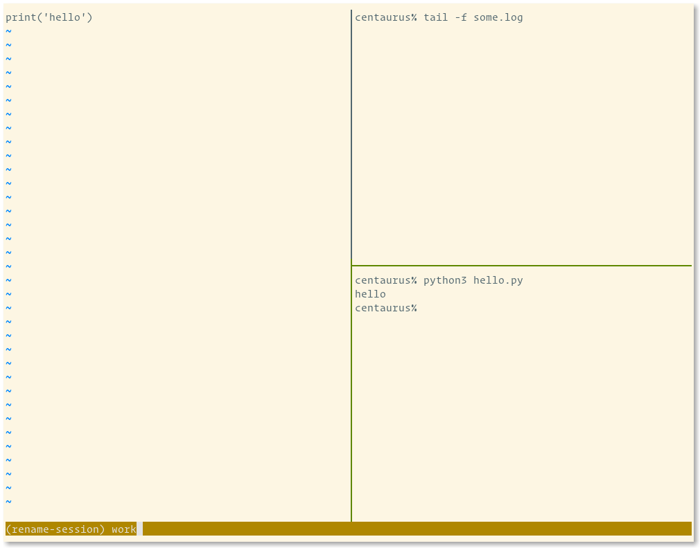
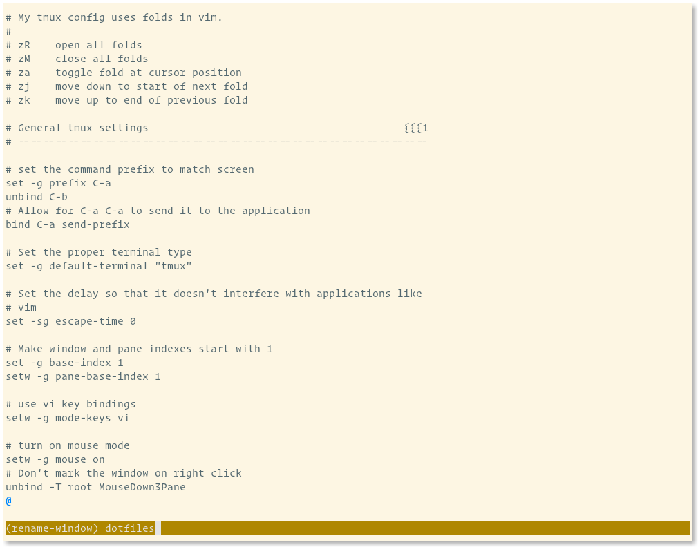

layout: true

---
class: middle, center

### What the tmux?
### [Dotfiles Indy Meetup][dotfiles-indy] | 08.2020 | Clayton Parker

---
class: middle, center

# Who Am I?


[@claytron][twitter-claytron] on the internets and IRL

My [dotfiles][dotfiles-claytron]

???
- known as claytron on the internet and in real life
- Links to my dotfiles and more. I'll share the slides after.

---
class: middle, center

# What is it?

tmux == Terminal MUltipleXer

A better `screen`

???
- Many terminals within a terminal
- A way to save your work for later or organize things locally
- A new take on the idea
- You NEED this in your life for sure

---
class: middle, left

# `tmux` vs `screen`

<table>
<tr valign="top">
<td width="50%">

<h2>Pros</h2>

<ul>
<li>Client / server model</li>
<li>Better keybinding support</li>
<li>Multiple paste buffers</li>
<li>More modern overall</li>
<li>BSD licensed</li>
</ul>

</td>

<td width="50%">

<h2>Cons</h2>

<ul>
<li>No serial / telnet terminal</li>
<li>No support for older platforms and odd terminals</li>
</ul>

</td>
</tr>
</table>

???
- windows are independent entities which may be attached simultaneously to multiple sessions and viewed from multiple clients (terminals), as well as moved freely between sessions within the same tmux server
- Vi / Emacs keybindings available out of the box, and support for mouse and scrolling also.
- A cleaner, modern, easily extended, BSD-licensed codebase.
- If you are stuck on some old mainframe, you could still use `screen`

---
class: middle, center

# How it works?

???
Let's take a tour of the basic functionality of tmux

---
class: middle, left

# Key Bindings

The `prefix` in tmux is `ctrl + b`

To avoid a conflict with screen's `ctrl + a`

Remap it in your `tmux.conf` if needed

```tmux
# Change the prefix and release ctrl + b
set -g prefix C-a
unbind C-b

# Ability to send ctrl + a to applications still
bind C-a send-prefix

```

???
- Note on the prefix before we get started
- Remap it to keep old muscle memory
- Or to avoid having to double tap to use `ctrl + b` normally (scroll back)
- More about key bindings later

---
class: middle, center

# Starting a new session


???
- The foundation of `tmux` is the session
- Every time you invoke `tmux` you are starting a new session

---
class: middle, center

# Sessions


???
- A session is started with a single window.
- A status line appears giving you info about the session.
- Another difference from default screen, automatic status line.

---
class: middle, center

# Sessions


`prefix + s`

???
Now we can see we have one session running one window.

---
class: middle, center

# Detaching


`prefix + d`

???
Now we are back to our original terminal, no longer in tmux.

---
class: middle, center

# Starting another session


???
Running tmux again starts a completely new session.

---
class: middle, center

# Sessions


???
We can see the session number is incremented in the status line.

---
class: middle, center

# Sessions


`prefix + s`

???
- Now we can see we have two sessions running.
- This view also allows keyboard navigation, so you can see more detailed info.

---
class: middle, center

# Attaching


???
- Now let's go back to our non tmux terminal.
- How do we get back to the original session?

---
class: middle, center

# Attaching


???
- Running `tmux` each time creates a new session.
- You can see a list of sessions with the `list-sessions` command (or `ls` for short)
- You can attach to a specific session using the `attach` command.
- The `-t` is the `target`

---
class: middle, center

# Attaching


???
Now we are back to the original session.

---
class: middle, center

# Windows and Panes

???
- The next most fundamental thing about tmux.
- Windows are a collection of panes.
- Each pane is a horizontal or vertical split of the window.

---
class: middle, center

# Windows and Panes


???
Starting out with one window in a new session.

---
class: middle, center

# Split Vertically


`prefix + %`

???
Split the window in two vertically

---
class: middle, center

# Split Horizontally


`prefix + "`

???
Split the current pane in two horizontally

---
class: middle, center

# Panes


`prefix + s`

???
Now we can see all the panes via the session list

---
class: middle, center

# New Window


`prefix + c`

???
Create a second window in this session

---
class: middle, center

# New Window


`prefix + "`

???
And another split just for fun

---
class: middle, center

# Session List


`prefix + s`

???
Go back to our session list and see everything we've created so far

---
class: middle, center


???
- Using the keyboard to navigate.
- Hitting left and right to open / close the tree.

---
class: middle, center


---
class: middle, center


---
class: middle, center


---
class: middle, center


---
class: middle, center


---
class: middle, center


???
- Now you can use the index on the side to go to a specific pane.
- Let's select `5`

---
class: middle, center

# Pane Selected


`5`

???
- Now back to the second session's first window, first split
- session 1 window 0 pane 1
- All zero based of course

---
class: middle, center

# Naming

Sessions and Windows can have names

???
- Our previous examples are all using numbered indexes
- Let's see how naming things can make that clearer

---
class: middle, center

# Naming


???
Let's say we have this in our first session

---
class: middle, center

# Naming


???
And this in the second

---
class: middle, center

# Naming



`prefix + $`

???
Let's name this one work

---
class: middle, center

# Naming


???
Now it is starting to make more sense

---
class: middle, center

# Naming


`prefix + ,`

???
- We can also rename the windows
- This will stop the current process from renaming them constantly

---
class: middle, center

# Naming


???
Starting to look better

---
class: middle, center

# Naming


`prefix + ,`

???
Rinse and repeat

---
class: middle, center

# Naming


???
Looking tidy now

---
class: middle, center

# Naming


???
Let's go back to the first session we created

---
class: middle, center

# Naming


`prefix + $`

???
Same process as before for this window

---
class: middle, center

# Naming


---
class: middle, center

# Naming



`prefix + ,`

???
And again for the window

---
class: middle, center

# Naming


???
Now everything has a proper name

---
class: middle, center

# Naming


`prefix + s`

???
Let's look at the list again for each session

---
class: middle, center

# Naming


???
Much more informative now

---
class: middle, center

# Pane Movement

TODO

---
class: middle, center

# Key Bindings

Defaults are vague and hard to remember

Vi and Emacs modes

???
Some notes...

---
class: middle, center

# Status line

TODO: screenshots / explanations?

---
class: middle, center

# Modality

TODO: maybe earlier in the talk?

???
- Normal mode sends keys to the terminal
- Using the prefix allows for commands to be run

---
class: middle, center

# Command Mode

TODO: screenshots / explanations?

???
- Manipulate everything from here
- Not often used, but handy for certain one off tasks

---
class: middle, center

# Copy Mode

TODO

???
- Probably my favorite feature
- I still use tmux in a tiling window manager because of this
- Modify the defaults to make it less aggravating

---
class: middle, center

# Mouse Mode

TODO

???
- The mouse is NOT evil!
- Modify it to make it MUCH more useful

---
class: middle, center

# Managing Environments

[Teamocil][teamocil]

[Tmuxinator][tmuxinator]

[And many more...][tmux-config-management]

???
- Lots of options
- Used Teamocil for years (because Arrested Development)
- Very helpful for repeated set ups locally or remote

---
class: middle, center

# Clients

Language libraries like python, ruby, etc.

---
class: middle, center

# Pair Programming

Wemux? TODO?

???
- Maybe not quite as easy as the VSCode pairing
- Could be good for two command line junkies though

---
class: middle, center

# Alternatives

Tiling Window Mangers

Builtin to terminal (e.g. iTerm2, Kitty, etc)

???
- Some of these features can be done with other programs
- I like the portability of tmux

---
class: top, left

# Links

- [My Dotfiles][dotfiles-claytron]
- [Awesome tmux](https://github.com/rothgar/awesome-tmux)
- Brian Hogan book TODO
- Tao of tmux book TODO
- TODO

[/ Links ---------------------------------------------------------------- /]: #
[dotfiles-indy]: https://meetingplace.io/Dotfiles-Indy
[twitter-claytron]: https://twitter.com/claytron
[dotfiles-claytron]: https://github.com/claytron/dotfiles
[teamocil]: https://github.com/remi/teamocil
[tmuxinator]: https://github.com/tmuxinator/tmuxinator
[tmux-config-management]: https://github.com/rothgar/awesome-tmux#tools-and-session-management
[/ ---------------------------------------------------------------------- /]: #
